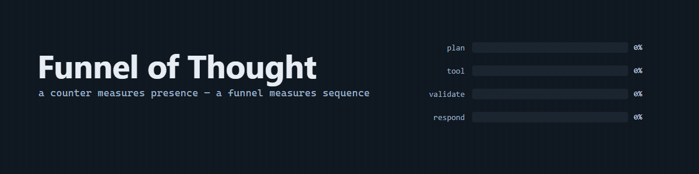
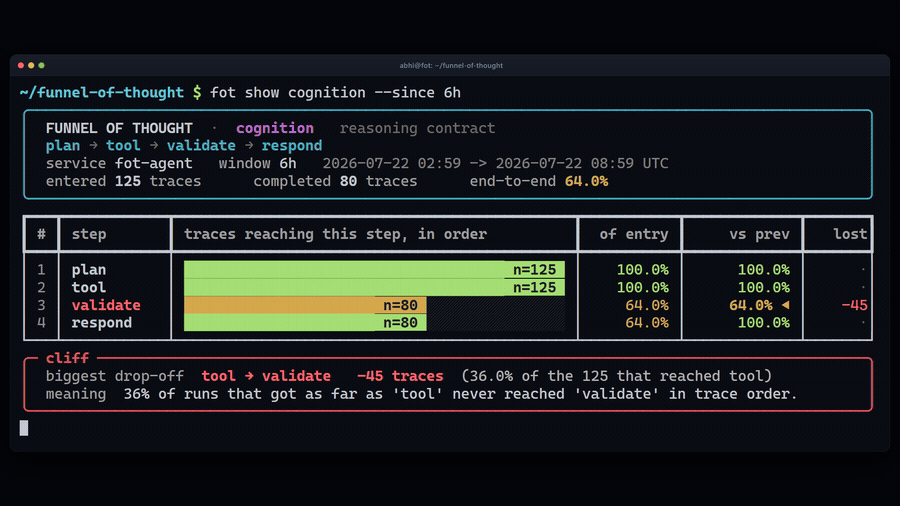
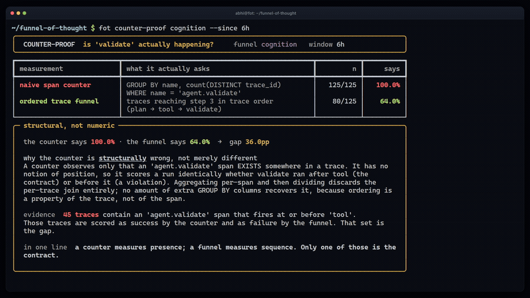
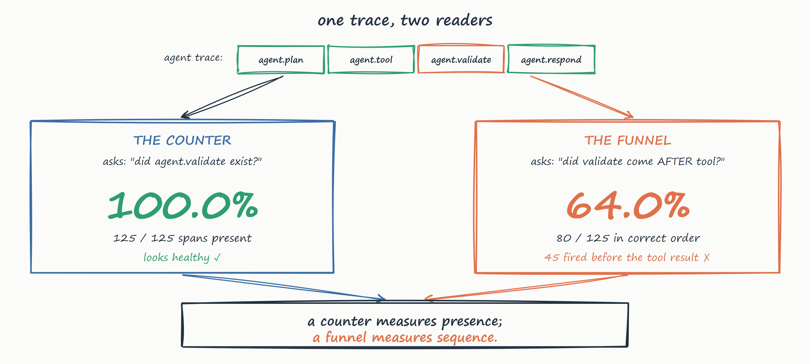
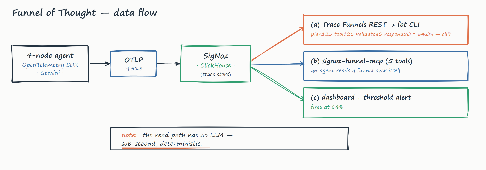

# Funnel of Thought

[](https://github.com/wiz-abhi/funnel-of-thought/actions/workflows/ci.yml)
[](fot/tests)
[](casting.yaml)
[](LICENSE)

**An AI agent that watches itself think — and tells you the exact step where it stopped.**

**▶ [Watch the 3-min demo](https://youtu.be/N9_sCORyT2E)** · **[Try it live](https://wiz-abhi-funnel-of-thought.static.hf.space)** · [Read the blog](https://medium.com/@abhiiishek0101/i-gave-my-ai-agent-a-funnel-over-its-own-reasoning-it-told-me-exactly-where-it-stops-thinking-b4e0d1cb53d1)



`plan → tool → validate → respond` is a contract. Most agents are trusted to
honour it and never measured against it. Funnel of Thought measures it, as a
conversion funnel, in SigNoz, live — and ships the funnel MCP tools that let
the agent run that measurement over its own traces without a human in the loop.

## The 30-second version

My agent has a validation step. A dashboard said it ran in **100% of runs**.
A funnel over the same **125 traces** said **64%**.



Both queries are correct. They answer different questions — and 45 runs emitted
their `validate` span **before the tool result existed**, so the agent validated
an answer that had not arrived yet. Every presence-based metric you own scores
those runs as a success.

> **A counter measures presence. A funnel measures sequence.
> Only one of those is the contract.**



The read path is deterministic REST over spans that already landed. No LLM
sits between you and the answer, so building a funnel and reading it back is a
sub-second operation you can repeat while the agent is still running. Inject a
validation regression and watch the `validate` bar sink and the alert fire
while you are still looking at the screen.

> SigNoz already markets Trace Funnels for exactly this shape of problem —
> tracking "drop-offs across your AI agent pipelines." As far as I can find,
> it is the only **trace-native** funnel primitive in an open-source APM, and
> they pointed it at agents first. This project is the adapter that makes that
> pairing work on a stock-OpenTelemetry agent, plus the five MCP tools that
> make it reachable from inside one.

---

## The problem

Every LLM-observability tool shows you traces — Langfuse, LangSmith, Phoenix,
Braintrust. Checking their docs in July 2026 I could not find a **funnel
primitive** in any of them: a way to ask *"of the runs that started reasoning,
what fraction completed each step, in order?"* SigNoz has one. (Corrections
welcome — that claim is about what I could find documented, not a proof of
absence. Datadog ships funnel analysis for RUM, but over page views, not spans.)
Pointing it at a spec-compliant agent needs things I could not find written
down anywhere. Building this surfaced six of them — the [blog](https://medium.com/@abhiiishek0101/i-gave-my-ai-agent-a-funnel-over-its-own-reasoning-it-told-me-exactly-where-it-stops-thinking-b4e0d1cb53d1) has the full story; in short:

- **Steps match on the *exact* span name** — no wildcards. The name you pick is load-bearing.
- **OTel's GenAI convention puts the model inside the span name** (`chat gemini-3.1-flash-lite`), so one logical step fragments across N names on any model swap, and the funnel silently reads 0%. Two correct specs, quietly incompatible.
- **A zero-match step returns `HTTP 500: unsupported value: NaN`**, not 0% — one function away from a guard that already exists. Filed as [#12143](https://github.com/SigNoz/signoz/issues/12143).
- **`latency_type: "p50"` silently returns p99** (measured: p50 = p99 = `18.67`, p90 = `17.96`). Filed as [#12220](https://github.com/SigNoz/signoz/issues/12220) with [PR #12221](https://github.com/SigNoz/signoz/pull/12221).
- **Funnels need strictly increasing timestamps** — steps inside one clock tick collapse to ~0 and 500. The single most useful undocumented thing we learned.
- **0 of SigNoz's 41 MCP tools touch funnels** — so `signoz-funnel-mcp` ships the five that do.

**The boundary that isn't a bug:** funnels are `minIf` + monotonic — they see
*first occurrence* and enforce *order*, so they're blind to loops and retries.
That's not fixable and defines where the instrument applies: **funnel the linear
contract; loops want a graph.**

---

## It runs in SigNoz, not just in my terminal

The funnel is a real SigNoz object — the CLI and SigNoz's own UI agree to the
decimal:


And the violation is visible in a single trace — `agent.validate` in red,
finishing *before* the `agent.tool` call whose output it was supposed to check:


---

## Architecture



A 4-node Gemini agent emits stock-OTel spans → SigNoz (cast by Foundry) stores
and funnels them → the [`fot`](fot/) CLI, [`signoz-funnel-mcp`](signoz_funnel_mcp/),
and a dashboard + alert read the result. **Everything past the agent is
deterministic — zero LLM calls at runtime.** The loop closes when the agent
calls `get_funnel_analytics` through the MCP server and reads its own conversion
rate — the hop that didn't exist before, because no MCP tool reached funnels.

---

## Quickstart

**Needs:** Docker and Python 3.11+. A Gemini key is **optional** — with no key everything below runs in `--stub` mode: identical span shape, zero LLM calls, seconds instead of minutes. Windows: [`scripts/setup.ps1`](scripts/setup.ps1) is a full port of `setup.sh`; `reproduce.sh` needs Git Bash.

```bash
git clone https://github.com/wiz-abhi/funnel-of-thought && cd funnel-of-thought
foundryctl cast                       # SigNoz + its MCP server (casting.yaml, pinned v0.132.2)
# create the admin account at http://localhost:8080, then:
cp .env.example .env                  # optional: set GEMINI_API_KEY for live latencies
python -m venv .venv && source .venv/bin/activate    # Windows: .venv\Scripts\Activate.ps1
pip install -e ".[all]"
./scripts/setup.sh                    # token, traces, funnels, dashboard, alert, gauges
fot show                              # the cliff, n on every bar
fot counter-proof                     # naive counter beside the ordered funnel
```

> No `foundryctl`? `docker compose -f pours/deployment/compose.yaml up -d` (the committed forge output).
> Funnel *writes* need an editor JWT, not an API key — `scripts/setup.sh --token` mints one into `.env` (re-run on a 401).

**The judge path — reproduce the whole finding in ≤10 min:**

```bash
./scripts/reproduce.sh
```

Generates a two-model batch, builds the funnels, prints the working cliff, reports the missing-vs-misordered split, then points the fragmented funnel at a bumped model version and shows the `500: unsupported value: NaN` verbatim. It maintains a failure counter and exits non-zero if any assertion it makes fails to reproduce.

**What it does and doesn't prove.** The drop-off rate is *injected*, not discovered: `--validate-rate 0.64` decides how many runs honour the contract, and the funnel's job is to recover 64% from the traces alone while a presence counter insists on 100%. That makes this a **calibration harness**, and the known injection rate is exactly what makes the counter's answer demonstrably wrong rather than merely suspect. What is *not* authored is the span-name fragmentation: stock OpenTelemetry named those spans and an ordinary version bump did the rest.

**Run the tests** (no SigNoz, no Docker, no key needed):

```bash
pytest -q
```

**MCP** (Claude Desktop / Code / Cursor): point a `signoz-funnel` server at `signoz-funnel-mcp` with `SIGNOZ_URL` + `SIGNOZ_JWT`, then ask *"build a funnel over my agent's reasoning steps and tell me which step is losing traces."* Five tools: `create_funnel`, `get_funnel_analytics`, `get_funnel_slow_traces`, `list_funnels`, `delete_funnel`. Config in [`signoz_funnel_mcp/README.md`](signoz_funnel_mcp/README.md).


## How it uses SigNoz

Remove SigNoz and this project cannot exist — there is no funnel primitive anywhere else to port to. Every surface is load-bearing:

| Surface | How it's used |
|---|---|
| **Traces** | Stock-OTel agent spans are the raw material every funnel is computed over. |
| **Trace Funnels** | The core primitive and the product — two funnels over one dataset (stable node spans → the cliff; the GenAI `chat {model}` span → 0% → 500). Reaches below the UI into the generated ClickHouse SQL. |
| **Query Builder** | The counter-proof: `GROUP BY span name` reports `validate` at ~100% while the ordered funnel reports 64%. |
| **Metrics** | Per-step conversion re-emitted as OTel gauges, turning a point-in-time funnel into a monitorable time series. |
| **Dashboards + Alerts** | Dashboard-as-code charts validate-conversion; a threshold rule fires when it drops — what makes the live demo *live*. |
| **MCP** | `signoz-funnel-mcp` ships the five funnel tools that 0 of the 41 existing tools provide, so an agent can build and read a funnel over itself. |

## What's novel

- **A funnel over cognition, not commerce** — pointing Trace Funnels at an agent's *reasoning contract*. I found no prior worked example of this on a stock-instrumented agent.
- **The five missing MCP tools** — an agent could reach every SigNoz surface *except* the one that measures its own completion rate. Now it can.
- **A named, reproducible incompatibility between two correct specs** — OTel GenAI says a span name describes the model; Trace Funnels say it identifies a step. Together they silently produce 0%. Generalises to any exact-match matcher.
- **Pre-registration** — [`PREDICTION.md`](PREDICTION.md) committed before any data was read, with falsification criteria and a control funnel. The drop-off is attributable, not asserted.
- **Speed as the feature** — no LLM on the read path, so *build → read → change → read* runs sub-second on live data. That's what lets an agent measure itself in real time.

## AI usage disclosure

Per the hackathon rules: **Claude Code was used as a development assistant** — scaffolding, reviewing the ClickHouse/Go analysis behind the NaN diagnosis, and editing prose here and in the blog. Every architectural decision, both bug diagnoses, and every claim of fact were made and verified by a human against a live SigNoz instance.

**No AI writes to the shipped runtime** — the MCP server, CLI, dashboard and alert make zero LLM calls; pure REST plus arithmetic. **The only model in the system is the one being observed:** `agent/` calls free-tier Gemini offline to generate the traces the funnel measures. Swap it for any OTel-instrumented agent and everything else works unchanged. All project code was written after the hackathon opened on 2026-07-20.

## Limitations

- **Funnels can't see loops.** `minIf` + monotonic step index → first occurrence wins, order enforced, so retry storms are invisible. A real ceiling on the primitive, not our code; a loop-aware graph view is the natural complement (**funnel the linear contract; loops want a graph**).
- **The observed agent is authored** — we wrote the 4-node agent for a clean `validate` node, and say so. What's *not* authored is the defect: stock OTel named the spans and an ordinary model swap did the rest. "Unauthored defect," never "unauthored agent."
- **Exact-name matching** is a constraint, not a bug — it's what keeps the query fast. The lesson: key funnels on names that are *identities* (`agent.validate`), not *descriptions* (`chat gemini-3.1-flash`).
- **Single-service scope** — every funnel here is over one `service.name`; cross-service is untested.
- **Upstream is *open*, not merged** — [#12143](https://github.com/SigNoz/signoz/issues/12143) filed + diagnosed; [#12220](https://github.com/SigNoz/signoz/issues/12220) + [PR #12221](https://github.com/SigNoz/signoz/pull/12221) for the p50 bug. Described as filed/open/proposed throughout — never merged.


## Repository layout

```
agent/                4-node LangGraph agent + batch trace generator
signoz_funnel_mcp/    MCP stdio server — the five missing funnel tools (+ tests/)
fot/                  core library + `fot` CLI (+ tests/)
web/                  the hosted demo page (FastAPI + a static build)
dashboards/           dashboard-as-code (SigNoz v5 schema)
alerts/               drop-off threshold alert
scripts/              setup.sh / setup.ps1 / reproduce.sh
blog/                 the write-up, its figures, and the video toolchain
docs/media/           README banner, hero GIFs, architecture sketch
spikes/               findings from the exploratory phase
.github/workflows/    CI: tests + lint on Linux and Windows, no SigNoz needed
casting.yaml          Foundry installation spec  (committed)
casting.yaml.lock     forged lockfile            (committed)
pours/                forged deployment manifests (committed)
docker-compose.yml    OUR containers, joined to signoz-network
PREDICTION.md         pre-registered hypotheses, committed before data
```

**109 unit tests**, none of which need SigNoz, Docker, or an API key:
`pytest -q`. CI runs them plus `ruff` on Linux and Windows, and asserts that the
`--json` contract `scripts/reproduce.sh` parses still exists — the wiring bug
that class of test is there to prevent.

---

## Acknowledgements

To the SigNoz team, for building the funnel primitive nobody else in open-source
APM seems to have, and
for making the source readable enough that both bugs here could be root-caused
from it in an afternoon. To **kunalpandey1** for
[PR #12160](https://github.com/SigNoz/signoz/pull/12160). To WeMakeDevs and
SigNoz for the Agents of SigNoz hackathon.

## License

[MIT](LICENSE).
