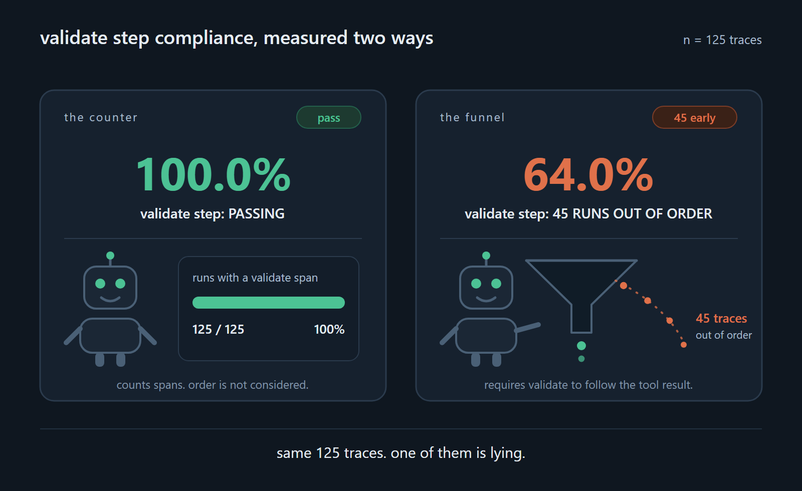
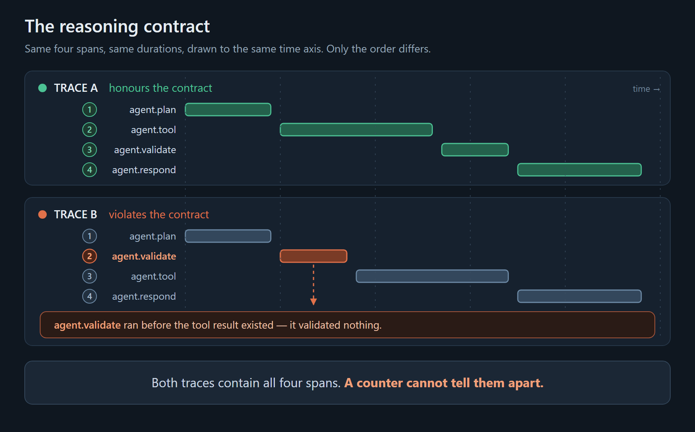
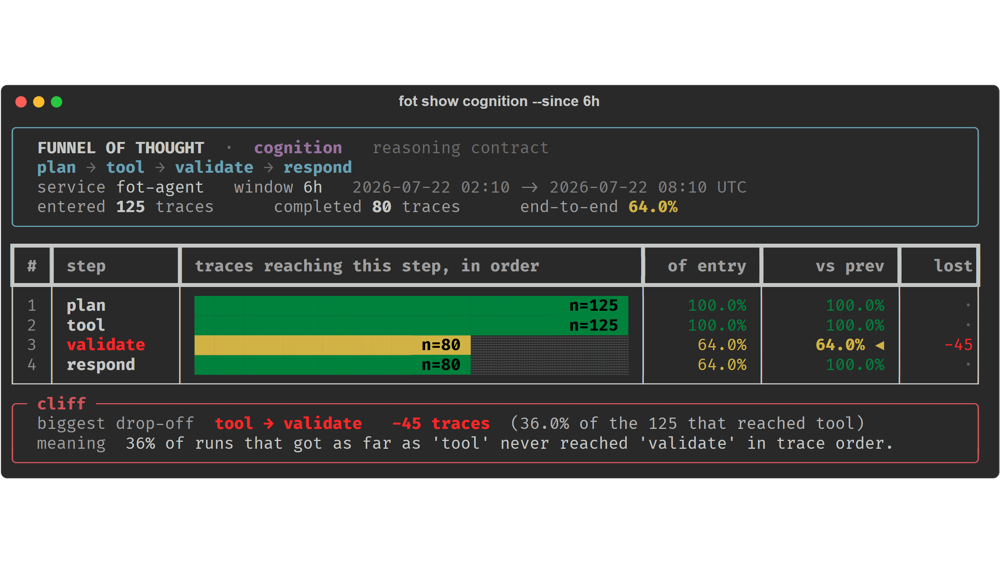
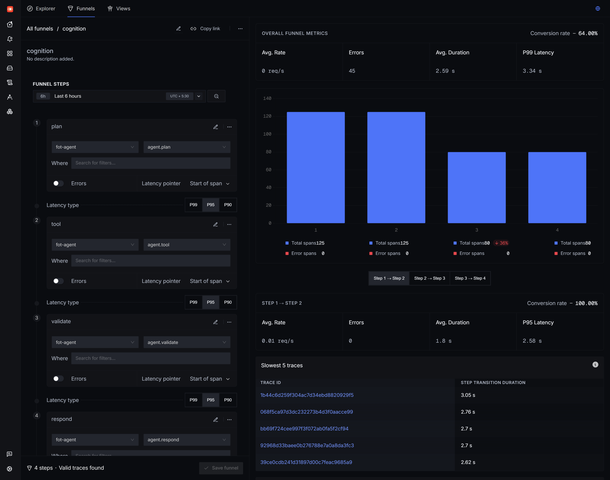
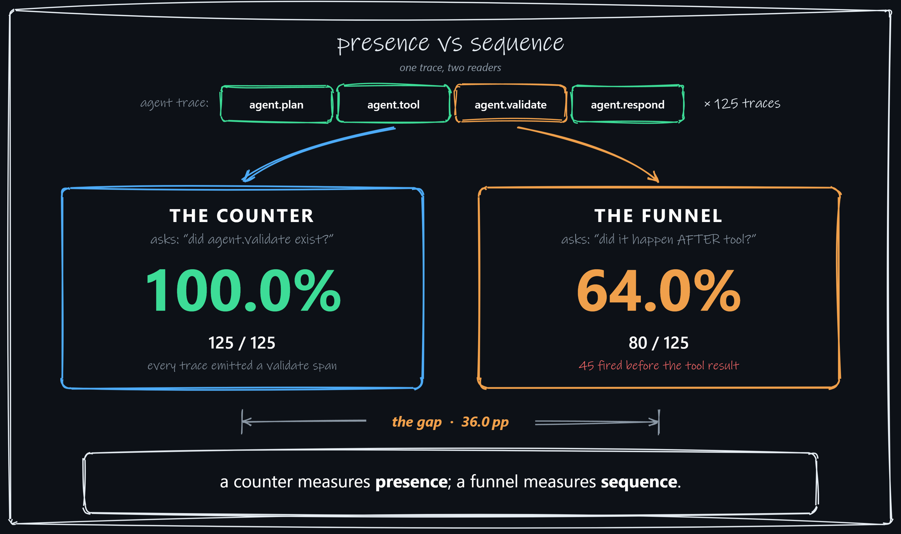
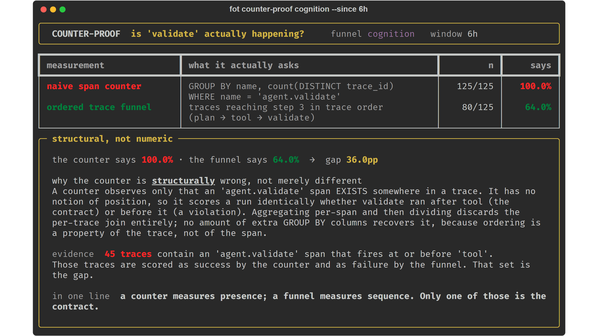
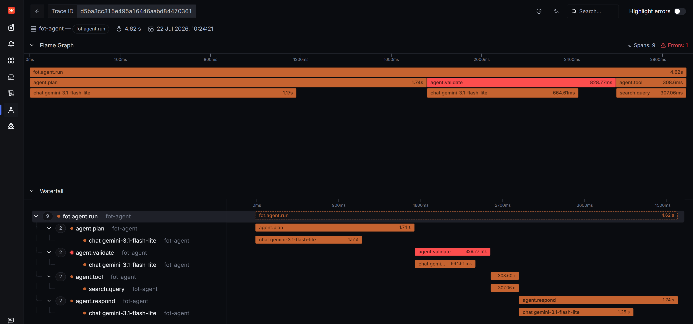
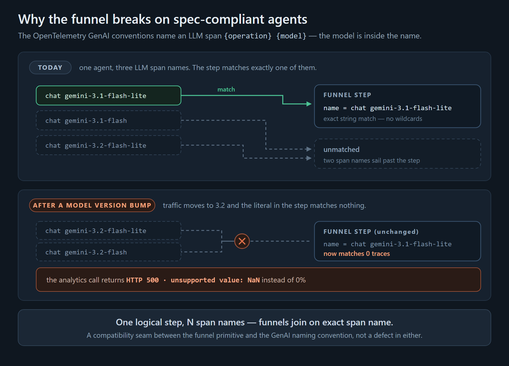
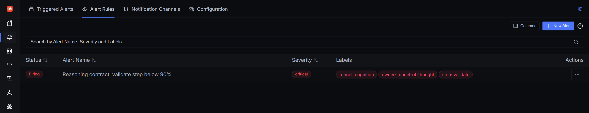

My agent has a validation step. It runs before the agent answers, and its whole job is to check the tool result.

A dashboard told me it ran in **100% of runs**. A funnel over the same 125 traces told me **64%**.

Both queries were correct. Only one was asking the right question.



## The contract nobody measures

Every agent has an implicit contract. Mine is four steps:

```
plan → tool → validate → respond
```

We trust agents to honour that order and then essentially never check. Traces show you *one* run. Evals score the *output*. Neither answers the population question: **of the runs that started reasoning, what fraction actually completed each step, in order?**

That question needs a primitive most observability tools don't expose — a **funnel**. Langfuse, LangSmith, Phoenix and Braintrust all give you traces and evals; none of them ships step-conversion as a first-class thing you can point at a trace. SigNoz does, and their AI page already suggests pointing it at agent pipelines. They got there first; this post is the working adapter.



## Building it

The agent is four nodes under the OpenTelemetry Python SDK. I'll be precise about what's authored: **the agent is mine** — you need a discrete `validate` node to have a contract worth measuring — but the interesting behaviour is not staged, and I'll come back to that.

Spans that matter:

- service `fot-agent`, root span `fot.agent.run`
- node spans `agent.plan`, `agent.tool`, `agent.validate`, `agent.respond`
- LLM children named by the OTel GenAI convention: `chat gemini-3.1-flash-lite`

Then the funnel, as code — create it, set four steps, read the analytics:

```python
POST /api/v1/trace-funnels/new
{"funnel_name": "cognition", "timestamp": 1784700000000}   # milliseconds

PUT  /api/v1/trace-funnels/steps/update
{"funnel_id": ..., "timestamp": <ms>, "steps": [
  {"step_order": 1, "service_name": "fot-agent", "span_name": "agent.plan",  ...},
  {"step_order": 2, "service_name": "fot-agent", "span_name": "agent.tool",  ...},
  {"step_order": 3, "service_name": "fot-agent", "span_name": "agent.validate", ...},
  {"step_order": 4, "service_name": "fot-agent", "span_name": "agent.respond", ...}]}

POST /api/v1/trace-funnels/{id}/analytics/steps
{"start_time": <NANOseconds>, "end_time": <NANOseconds>}
```

Two things cost me time and aren't documented anywhere: creation timestamps are **milliseconds** while analytics windows are **nanoseconds**, and if you send a step `id` it must be a real UUID — omit it and the server generates one.

The one rule that shapes everything: **steps match on exact span name.** No wildcards. So key your funnel on names that are *identities* (the node spans), never names that are *descriptions*.

Here's 125 live runs against `gemini-3.1-flash-lite`:


<figcaption>The CLI. n is printed on every bar, because a percentage without a denominator isn't evidence.</figcaption>

And the same funnel in SigNoz's own UI, which is where it actually lives:


<figcaption>Conversion rate 64.00%. Total spans 125 → 125 → 80 → 80, with ↓36% flagged on step 3.</figcaption>

**64%.** A third of the runs that reached `tool` never reached `validate` in trace order. The agent has a validation step and skips it, or runs it in the wrong place, in more than a third of its runs — and that is invisible to a trace view and invisible to any eval that only scores final answers.

## Why the obvious query can't see this

Before funnels, the natural move is Query Builder: `GROUP BY span name → COUNT`. I ran it on exactly the same traces.



The counter reports **125 of 125 — 100.0%**. The funnel reports **80 of 125 — 64.0%**.

Both are correct. They answer different questions:

- a counter asks **"did this span ever appear?"**
- a funnel asks **"did it appear *after* the previous step, in the same trace?"**


<figcaption>Both numbers, same window, same traces.</figcaption>

The 45 traces in that gap all contain an `agent.validate` span. They just emitted it **before the tool result existed** — the agent confidently validated an answer that hadn't arrived yet. Every presence-based metric you have scores those runs as success.

Open one and it's plainly visible in the waterfall:


<figcaption>plan → <strong>validate</strong> → tool → respond. The red span is <code>agent.validate</code>, and it has already finished before <code>agent.tool</code> starts — it validated a tool result that did not exist yet. Nine spans, one error, and the run still returned an answer.</figcaption>

That's the transferable idea, and it's worth stating sharply: a counter isn't a coarser answer, it's the **wrong question**. Aggregating per-span and dividing throws away the per-trace join, and no amount of extra `GROUP BY` columns gets it back — ordering is a property of the trace, not of the span.


## Three potholes

Briskly, because you'll hit them too.

**1. Funnels need strictly increasing timestamps.** The SQL is `minIf(timestamp, …)` per step, gated on `t2 > t1` — strictly. My first run emitted 100 perfectly ordered, correctly named traces and the funnel reported **6%**, because the spans were instantaneous and shared one timestamp. A funnel is blind to steps that finish inside the same clock tick. This is why my agent's per-node work is load-bearing rather than padding.

**2. A step matching zero traces returns `HTTP 500: unsupported value: NaN`, not 0%.** I reached it by bumping the model `gemini-3.1 → 3.2`. The GenAI convention puts the model name *inside* the span name, so one logical step fragments across N literal names and the funnel matches nothing. Two specs, each correct, quietly incompatible. Filed as [#12143](https://github.com/SigNoz/signoz/issues/12143).



**3. `latency_type: "p50"` returns p99.** Measured on one funnel, varying only that field: p50 = `18.673343`, byte-identical to p99, while p90 = `17.96` and p95 = `18.01`. A median reporting higher than the p90 of the same data. Filed as [#12220](https://github.com/SigNoz/signoz/issues/12220) with a [PR](https://github.com/SigNoz/signoz/pull/12221).

These are the findings of someone leaning on the feature hard, and I'd rather have the funnel with the potholes than not have it — nobody else ships one.

## The loop closes

Here's the gap that made this worth building: **0 of SigNoz's 41 shipped MCP tools touch funnels.** An agent can reach traces, metrics, logs, dashboards and alerts — everything except the one primitive that measures its own completion rate.

So I shipped the missing ones. `signoz-funnel-mcp` — five tools: `create_funnel`, `get_funnel_analytics`, `get_funnel_slow_traces`, `list_funnels`, `delete_funnel`:

```json
{"mcpServers": {"signoz-funnel": {
  "command": "docker",
  "args": ["run","-i","--rm","--network","host",
           "-e","SIGNOZ_URL=http://localhost:8080",
           "-e","SIGNOZ_JWT","signoz-funnel-mcp"]}}}
```

The agent emits spans → SigNoz computes the funnel → **the agent calls `get_funnel_analytics` and reads its own conversion rate.** It returns per-step `n`, the drop-off, and the cliff. A loop that wasn't previously expressible.

And it's *fast*, which is the part I didn't expect to care about. The read path has **no model in it** — it's REST over spans that already landed, plus arithmetic. Build-and-re-read is sub-second. An agent that *reasons* about telemetry takes ~40 seconds and costs money per investigation; this takes about a second and costs nothing, because it's an **instrument**, not an investigator. That's also why it can live in a dashboard panel and a threshold alert instead of being run on demand.


That's also what makes it operational rather than a chart you visit. `fot gauges` re-emits each step's conversion as an OTLP gauge on a tick, so the funnel becomes something a dashboard panel and a threshold rule can read. Point a rule at the validate step with a floor of 90% and it goes red on its own:


<figcaption>Firing at 64% against a 90% floor. Labelled by funnel and step, so the page tells you which contract broke.</figcaption>

## The boundary, and one thing I got wrong

Funnels aggregate with `minIf` over a monotonic step index: first occurrence wins, order is enforced. So they are **structurally blind to loops and retries** — validated once and validated five times after four failures are the same funnel. Phoenix's agent-path graph and Datadog's execution-loop view are the loop-aware complements. Funnel the linear contract; loops want a graph. That's the ceiling, and owning it is the contribution.

I committed [`PREDICTION.md`](https://github.com/wiz-abhi/funnel-of-thought) before reading a single analytics response. **One prediction missed**: I said a funnel keyed on a fragmented LLM span would read 0%. It actually reads 58.33% when the old model still has traffic — you only get 0%-then-500 once nothing matches. I left the file unedited, because a pre-registration you amend after seeing data is worth nothing.

And one failure I didn't author at all: mid-batch, my generator **hung for 34 minutes**. 64 of 120 runs done, process alive, no error, no log line — while the API it was waiting on answered in 1.4 seconds. The LLM client had no timeout.


Which is the whole thesis arriving uninvited. Traditional services crash. Agents wait politely, skip their homework, and hand in a confident answer anyway.

**The one thing to take:** watch validate-step conversion, and alert on the cliff.

---

**▶ [3-minute demo](https://youtu.be/N9_sCORyT2E)** · **[Live demo](https://wiz-abhi-funnel-of-thought.static.hf.space)** · **[Code](https://github.com/wiz-abhi/funnel-of-thought)**

*Built for the [Agents of SigNoz](https://www.wemakedevs.org/hackathons/signoz) hackathon (Track 1: AI & Agent Observability). The repo has the agent, the `fot` CLI, the MCP server, funnel/dashboard/alert definitions, and `casting.yaml` + lock so you can re-cast the whole stack.*

*AI disclosure: I used Claude as a coding assistant throughout — building the agent, the CLI and the MCP server, and drafting this post. Every number here was measured on my own machine against self-hosted SigNoz v0.132.2; every claim was verified before publishing, and the ones that didn't survive verification were cut.*
